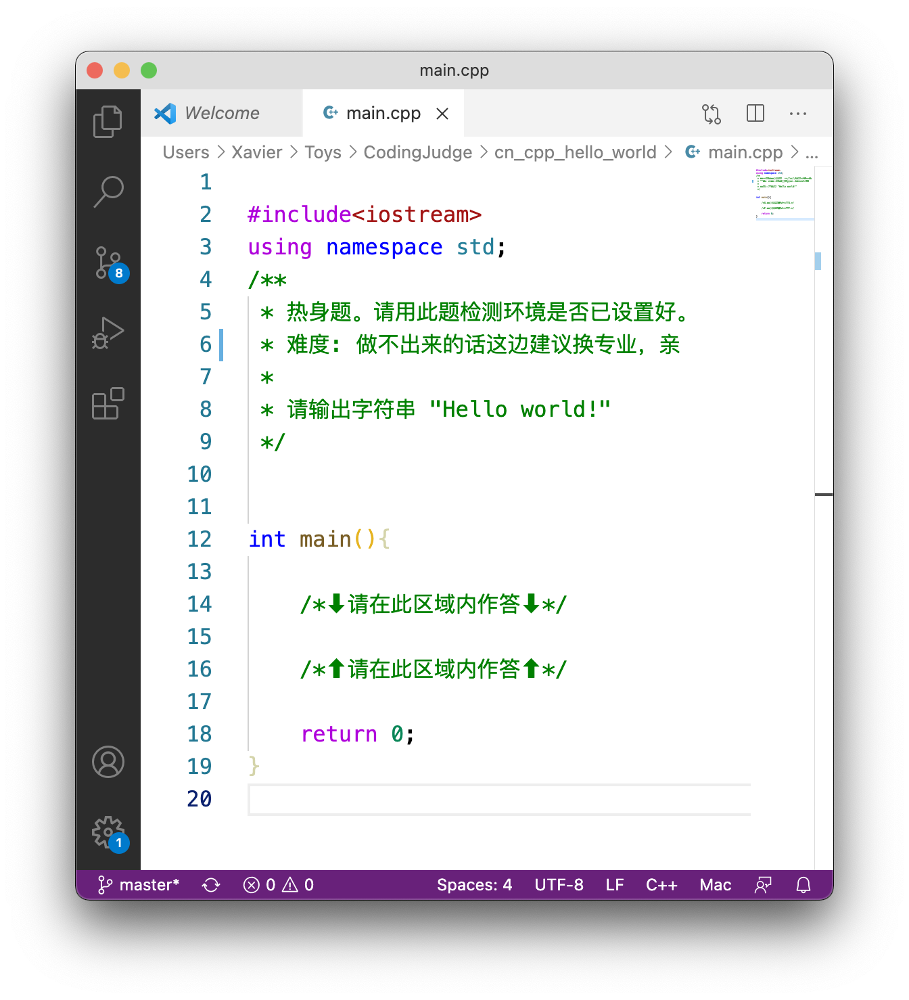
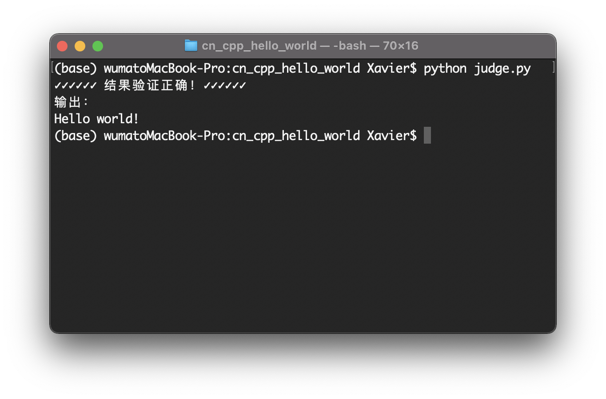
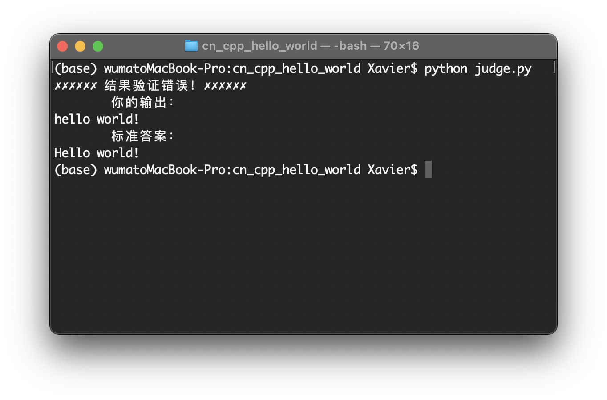
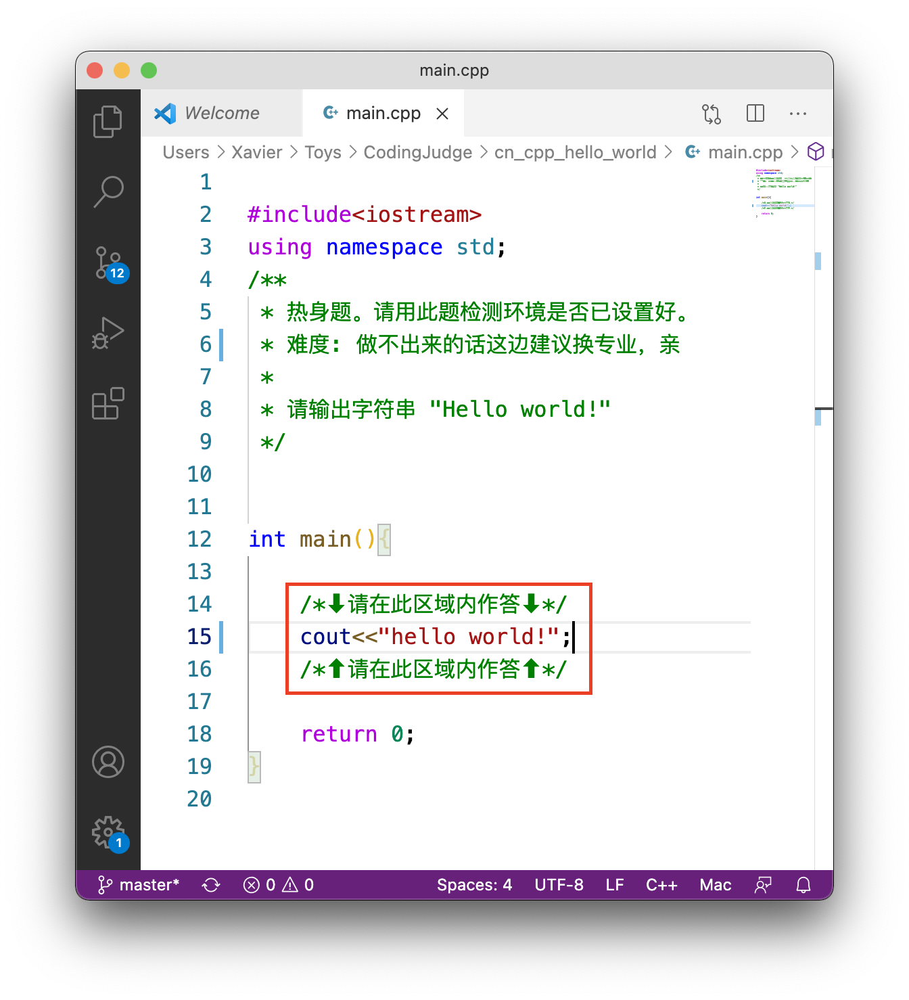
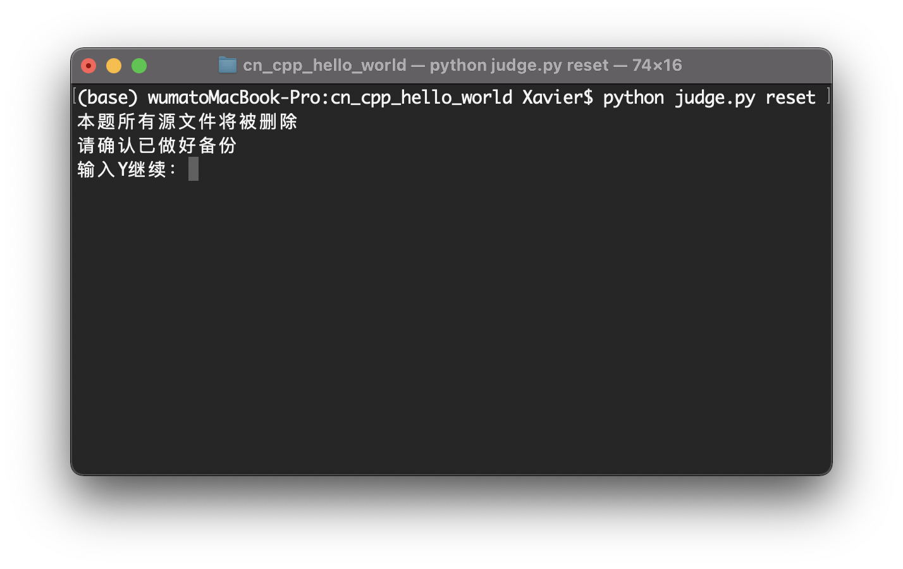

# 湖北工业大学计算机学院CodingJudge系统

本系统用于湖北工业大学计算机学院数据结构课程。

## 1.使用环境配置

### 1.1.安装GCC

#### 1.1.1.Window

从
http://www.mingw.org
或者
https://jmeubank.github.io/tdm-gcc/
下载GCC进行安装。
推荐使用tdm-gcc。

#### 1.1.2.macOS

从Mac app store下载安装Xcode。
安装Xcode Command Line Tools。

https://developer.apple.com/xcode/

#### 1.1.3.Linux

在终端窗口中输入以下命令以安装GCC

``` batch
sudo apt install gcc
```

### 1.2.检查GCC是否正确安装

在命令提示符或终端窗口中输入命令

``` batch
gcc
```

若提示没有输入文件，则说明GCC已经正确安装。
否则请按照以下提示安装GCC。

### 1.3.安装Python3

前往 https://www.python.org 下载并安装Python3。

### 1.4.检测Python3是否正确安装

在终端窗口中输入命令

``` batch
python
```

将进入python解释器。

若类似的以下信息出现，则说明python3已正确安装。
不同系统平台可能会显示不同的信息，但python版本信息以及“>>>“符号一定会显示。

``` batch
Python 3.8.3 (default, Jul  2 2020, 11:26:31) 
[Clang 10.0.0 ] :: Anaconda, Inc. on darwin
Type "help", "copyright", "credits" or "license" for more information.
>>> 
```

在“>>>“符号后输入

``` batch
exit()
```

退出python解释器。

注意，某些平台Python3的启动命令可能是

``` batch
python3
```

或者

``` batch
py
```

### 1.5.安装VS Code（可选）

一个好用的文本编辑器，能够使编程体验更加舒适。
我们推荐使用Visual Studio Code。
从 https://code.visualstudio.com 下载安装。

也可以使用其他你觉得顺手的文本编辑器。

## 2.使用方法

注意，使用本系统前必须正确安装GCC以及Python3。


将整个“CodingJudge“文件夹可以放置于任何你觉得合适的位置。

在“CodingJudge“文件夹中，每一个子文件夹包含一个题目

``` batch
CodingJudge
    |
    |---cn_cpp_hello_world
    |---cpp_linked_list_insertion
    ...
```

以“cn_cpp_hello_world”为例，在此文件夹下应该能看到以下两个文件

``` batch
cn_cpp_hello_world
    |
    |---main.cpp
    |---judge.py
    ...
```

main.cpp 文件为题目原始代码文件，其中包含完整题目内容信息。
根据题目要求补全main.cpp中的空白部份。



完成作答后保存文件，使用以下方法判定作答是否正确：

1. 在终端（命令提示符）窗口中，使用“cd”命令将当前cn_cpp_hello_world文件夹设为当前路径。

1. 输入命令

``` batch
python judge.py
```

若作答正确，则显示以下内容：



注意，系统以程序的标准输出作为评判标准，打印输出必须与标准答案完全一致。




<span style="color:red">
作答时，请仅在规定范围内编写代码，超出范围的代码将被系统忽略。同时不要更改任何题目中原有的注释语句。
</span>



可以将所有题目源文件拷贝到其他地方进行编辑，完成调试后再拷贝回原位置覆盖原文件，再使用 python judge.py 命令进行判定。

使用命令

``` batch
python judge.py reset
```

可以重制当前题目。
注意，应仅在破坏题目源文件本身的情况下使用此命令。
使用此命令将会丢失之前输入的内容。



judge.py脚本仅在题目文件夹下有效，且此题目文件夹必须存在于CodingJudge文件夹下。
